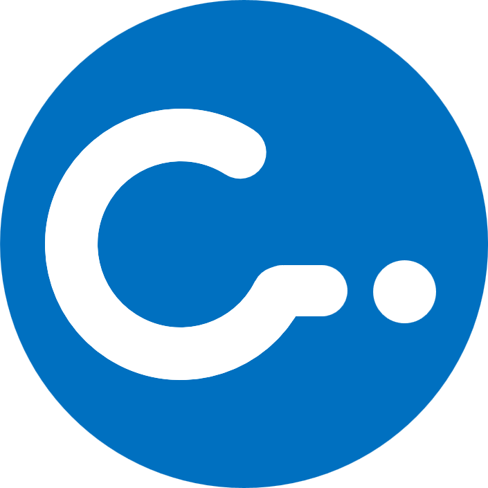
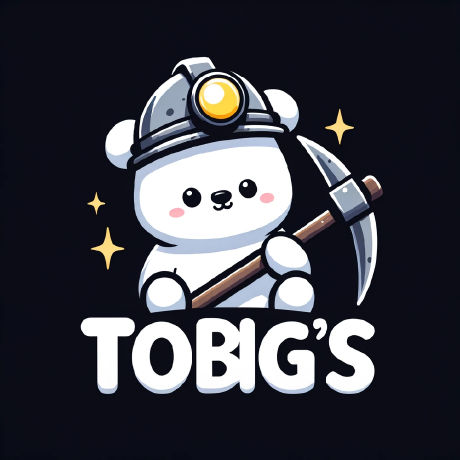

## About Me

🎓 Applied Statistics major / AI double major @ Chung-Ang University, Seoul, South Korea

🔍 Interested in Multimodal Learning, Representation Learning and Vision-Language Models

🧠 Exploring robust and generalizable AI methods

📫 Contact

  

## Experience

<h3>
  
  <a href="https://cai.cau.ac.kr/">CAI Lab </a> , Chung-Ang University
</h3>

**Undergraduate Research Intern** : Jan. 2026 – Jun. 2026

- Conducted research on **CLIP** and **Test-Time Adaptation**

<h3>
  
  <a href="https://www.datamarket.ai.kr/">TOBIG'S</a>
</h3>

**Education Team Lead & Member** : Jul. 2025 – Jul. 2026

- **iPAD: Interpretable Physical Attribute-based Anomaly Detection**  
  Designed a DINOv3–CLIP pipeline for patch-level anomaly localization and interpretable attribute prediction.

- **News Video-to-Card News Generation**  
  Built a multimodal news summarization pipeline combining speaker diarization, STT, timestamp alignment, and key-frame extraction.

- Organized AI/ML educational sessions and managed the curriculum.

## Tech Stack

**Languages**

   

**AI / ML**

   
 
 
**Tools**

   	

## GitHub Stats

